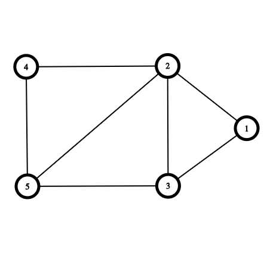
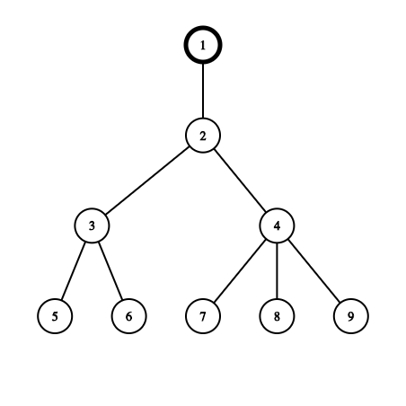
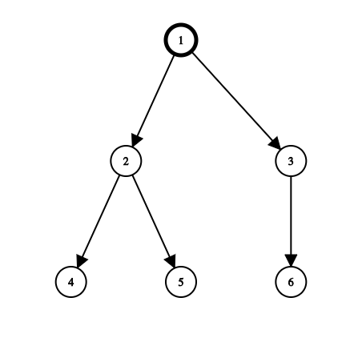
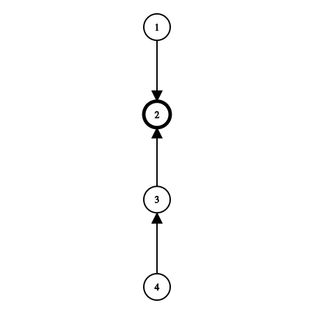
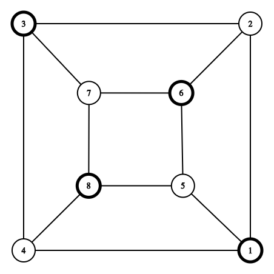
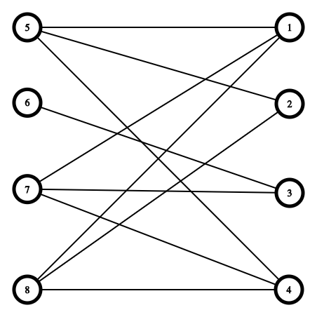
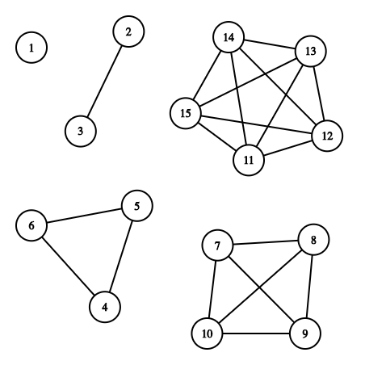

# Graph
Graph Theory is the mathematical theory of the properties and applications of the graphs (networks). 

## **Representation of Graph**
    - Adjacency Lists
    - Adjacency Matrices 



### **Adjacency Lists**
Adjacency List representation provides a compact way to represent sparse graphs — those for which |E| is much less than |V|<sup>2</sup>

For the above graph adjacency list will be
```html
1 -> 2 -> 5 -> /
2 -> 1 -> 5 -> 3 -> 4 -> /
3 -> 2 -> 4 -> /
4 -> 2 -> 5 -> 3 -> /
5 -> 4 -> 1 -> 2 -> /
```

#### Pros
    - Space efficient for representing sparse graphs.
    - Iterating over all the edges is efficient.
    
#### Cons
    - Less space eficient for denser graphs.
    - Edge weight lookup is O(E)
    - Slightly more complex graph representation.

### **Adjacency Matrices**
Adjacency Matrix representation, however, when the graph is dense — |E| is close to |V|<sup>2</sup> — or when we need to be able to tell quickly if there is an edge connecting two given vertices


| | 1 | 2 | 3 | 4 | 5 |
|:---|:---:|:---:|:---:|:---:|:---:|
| **1** | 0 | 1 | 0 | 0 | 1 |
| **2** | 1 | 0 | 1 | 1 | 1 |
| **3** | 0 | 1 | 0 | 1 | 0 |
| **4** | 0 | 1 | 1 | 0 | 1 |
| **5** | 1 | 1 | 0 | 1 | 0 |

#### Pros
    - Space efficient for representing dense graph.
    - Edge weight lookup is O(1)
    - Simplest Graph representation
    
#### Cons
    - Requires O(V^2) space
    - Iterating over all the edges takes O(V^2) time.


## **Types of Graph**
- **Undirected Graph** : An undirected graph is a graph in which edges have no orientation, The edge (u, v) is identical to edge (v, u).
- **Directed Graph (Digraph)** : A directed graph or digraph is a graph in which edges have orientation, ie., the edge (u, v) is the edge from node u to node v.

## **Speacial Graphs**
- **Tree** : A tree is an undirected graph with no cycles. Equivalently it is connected with `N` nodes and `N - 1` edges.
    
- **Rooted Tree** : A rooted tree is a tree with designated root node where every edge either points away or towards the root node. When edges point away from the root, the graph is called arborescence (out-tree) and anti-arborescence (in-tree) otherwise.
     
- **Directed Acyclic Graph (DAG)** : DAGs are directed graphs with no cycle. These graphs play an important role in representing structures with dependecies. All out-tree are DAGs but vice versa is not true.
    
- **Bipartite Graph** : A bipartite graph is one whose vertices can be split into two independent groups U, V such that every edge connects between U and V. There is no odd length cycle.
    
- **Complete Graph** : A complete graph is one where there is unique edge between every pair of nodes. A complete graph with n vertices is denoted as the graph K<sub>n</sub>. 
    
    

### **For solving any problem, ASK YOURSELF**
- Directed or Undirected
- Edges of the graph weighted or unweighted
- Sparse or dense with edges
- Adjacency Matrix or Adjacency List

### **Problems and Algorithms used**
- **Shortest Path Problem** : Sortest Path between one node to another.
    - BFS (unweighted graph)
    - Dijkstra's 
    - Bellman Ford
    - Floyd Warshall
    - A* etc.
- **Connectivity** : Does there exist a path between node A and node B
    - Union FInd Data Structures
    - Any Search Algorithm (eg., DFS, BFS) 
- **Negative Cycles** : Does any weighted digraph have any negative cycles? If so, where?
    - Bellman Ford
    - Floyd Warshall
- **Strongly Connected Components** : It can be thought of as self contained cycles within a directed graph where every vertex in a given cycle can reach every other vertex in the same cycle.
    - Tarjan's and Kosaraju's Algorithm
- **Travelling Salesman Problem** : This is NP hard problem.
    - Held Karp
    - Branch and Bound
    - Many Approximation Algorithm  
- **Bridges** : A bride / cut edge is any edge in a graph whose removal increases the connected components.
- **Articulation Points** : An articulation point / cut vertex is any node in a graph whose removal increases the connected components.   
- **Minimum Spanning Tree** : A minimum spanning tree (MST) is a subset of the edges of a conected, edge weighted graph that connects all the vertices together, without any cycle and with the minimum total edge weight. 
    - Kruskal's 
    - Prim's 
    - Boruvka's 
- **Network Flow or Max Flow** : Suppose the edges of the graphs represent the pipes with water. FLow represents the volume of water allowed to flow through the pipes. To find the maximum volume of water that can flow through this network.
    - Ford Fulkersion
    - Edmonds Karp & Dinic's Algorithm
    
## **Graph Theory**
### **Depth First Search (DFS)**
The Depth First Search (DFS) is the fundamental search algorithm used to explore nodes and edges of a graph. It runs with a time complexity of `O( V+E )` and is often used as a building block in other algorithm.

```python
def dfs(at, graph, visited):
    if visited[at]:
        return
    visited[at] = True
    print(at)
    neighbours = graph[at]
    for next in neighbours:
        dfs(next, graph, visited)
```

### Problems that can be solved using DFS
- Compute a graph's Minimum Spanning Tree
- Detect and Find Cycles in a graph
- Check if a graph is bipartite
- Find Strongly Connected Components
- Topologically sort the nodes of a graph
- Find bridges and articulation points
- Find augmenting paths in a flow network
- Generate mazes

### **Breadth First Search (BFS)**
The Breadth First Search (BFS) is the fundamental search algorithm used to explore nodes and edges of a graph. It runs with a time complexity of `O( V+E )` and is often used as a building block in other algorithm.
It is particularly useful in finding the shortest path on unweighted graph.
