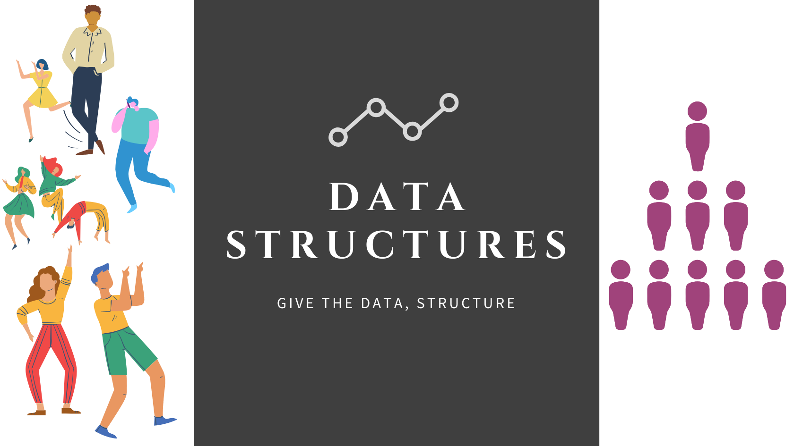

# Data Structures


#### *A data structure is a way of organizing data so that it can be used effectively.*

## Contents

- [Abstract Data Type](https://github.com/ramanaditya/data-structure-and-algorithms/tree/master/DataStructures#abstract-data-type)
- [Computational Complexity Analysis](https://github.com/ramanaditya/data-structure-and-algorithms/tree/master/DataStructures#computational-complexity-analysis)
- [Array](https://github.com/ramanaditya/data-structure-and-algorithms/tree/master/DataStructures/Array)
- [Tree](https://github.com/ramanaditya/data-structure-and-algorithms/tree/master/DataStructures/tree)

## Abstract Data Type
An Abstract Data Type is an abstraction of Data Structures which provides only the interface to which a data structure must adhere to.
The interface doesn't give any specific details about how something should be implemented or in what programming language. 

| Abstraction (ADT) | Implementation (DS) |
| --- | --- |
| List | - Dynamic Array |
| | - Linked List |
| Queue | - Linked list Based Queue |
| | - Array Based Queue |
| | - Stack Based Queue |
| Map | - Tree Map |
| | - Hash Map / Hash Table |

## Computational Complexity Analysis
There are only two things on which everything in Computer Science depends
- ```Time Complexity : The time complexity of an algorithm is the amount of computer time it needs to run to completion. ``` 
- ```Space Complexity : The space complexity of an algorithm is the amount of memory it needs to run to completion. ``` 

    ### Big-O Notation
    It gives an upper bound of the complexity in the worst case. 
    
        - Constant Time : O(1)
        - Logarithmic Time : O(log(n))
        - Linear Time : O(n)
        - Linearithmic TIme : O(nlog(n))
        - Quadric Time : O(n^2)
        - Cubic Time : O(n^3)
        - Exponential : O(b^n) , b > 1
        - Factorial TIme : O(n!)
        
    Big-O Properties
    
        - O(n + c) = O(n)
        - O(cn) = O(n)
