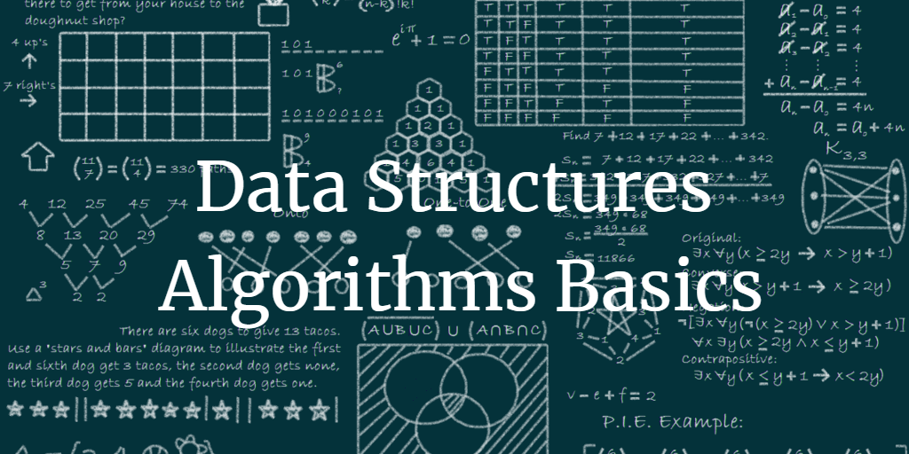

 
 

 

## Documentation

This is well documented and maintained at the `Read the Docs`. 

Follow the link [https://interview-docs.readthedocs.io](https://interview-docs.readthedocs.io) or click the image below to read the Complete Interview Docs

## Community

### Gitter Community
All the discussions related to the **Interview** and **Data Structures and Algorithms** are discussed on the Gitter Community Channel.

Follow the link [https://gitter.im/data-structure-and-algorithms/community](https://gitter.im/data-structure-and-algorithms/community) or click the Gitter Logo on the left to join the community

 

# Contents

- ## [Data Structures](DataStructures)
    - [Abstract Data Type](https://github.com/ramanaditya/data-structure-and-algorithms/tree/master/DataStructures#abstract-data-type)
    - [Computational Complexity Analysis](https://github.com/ramanaditya/data-structure-and-algorithms/tree/master/DataStructures#computational-complexity-analysis)
    - [Array](https://github.com/ramanaditya/data-structure-and-algorithms/tree/master/DataStructures/Array)
    - [Linked List](https://github.com/ramanaditya/data-structure-and-algorithms/tree/master/DataStructures/LinkedList)
    - [Tree](https://github.com/ramanaditya/data-structure-and-algorithms/tree/master/DataStructures/tree)
    
- ## [Algorithms](algorithms)
    - ### Array
        - [Boyer Moore Majority Vote Algorithm](https://github.com/ramanaditya/data-structure-and-algorithms/blob/master/algorithms/array/boyer-moore-majority-vote-algorithm.md)
    - ### Linked List
        - [Floyd's Tortoise and Hare](https://github.com/ramanaditya/data-structure-and-algorithms/blob/master/algorithms/LinkedList/floyds_tortoise_and_hare.py)
    - ### Searching
        - [Searching](https://github.com/ramanaditya/data-structure-and-algorithms/tree/master/algorithms/searching)
    - ### Sorting
        - [Sorting](https://github.com/ramanaditya/data-structure-and-algorithms/tree/master/algorithms/Sorting)
    
- ## [Interview Preparation](interview)
    - [Interview Preparation](./interview/README.md)
    - [Networking](./interview/networking.md)

- ## Solution of Books
    - [CLRS](https://github.com/ramanaditya/data-structure-and-algorithms/tree/master/CLRS)
    - [Cracking the Coding Interview](https://github.com/ramanaditya/data-structure-and-algorithms/tree/master/cracking-the-coding-interview)
    - [Elements of Programming Interviews]()

- ## [Programming Languages](./languages)
    - [Python](./languages/python)

- ## Competitive Coding
    - #### [Codechef](https://github.com/ramanaditya/data-structure-and-algorithms#abstract-data-type)
     
      | [Cookoff](https://github.com/ramanaditya/data-structure-and-algorithms/tree/master/codechef#cook-off-2) | [Long Challenge](https://github.com/ramanaditya/data-structure-and-algorithms/tree/master/codechef#long-challenge) |
      | :---: | :---: |
      | [Easy](https://github.com/ramanaditya/data-structure-and-algorithms/tree/master/codechef#long-challenge) | |
     
    - #### [Codezforces](https://github.com/ramanaditya/data-structure-and-algorithms/tree/master/codeforces)
    
        | [Div 2](https://github.com/ramanaditya/data-structure-and-algorithms/tree/master/codeforces#div-2) | [Div 3](https://github.com/ramanaditya/data-structure-and-algorithms/tree/master/codeforces#div-3) |
        | :---: | :---: |
        | [April Fools Day](https://github.com/ramanaditya/data-structure-and-algorithms/tree/master/codeforces#april-fools-day) | |
        
    - #### [HackerEarth](https://github.com/ramanaditya/data-structure-and-algorithms/tree/master/hackerearth)
        
        | [Circuits](https://github.com/ramanaditya/data-structure-and-algorithms/tree/master/hackerearth#circuits) | [CodeArena](https://github.com/ramanaditya/data-structure-and-algorithms/tree/master/hackerearth#codearena) |
        | :---: | :---: |
        
    - #### [HackerRank](https://github.com/ramanaditya/data-structure-and-algorithms/tree/master/hackerrank)
        - [Contest : MentorshipKarona Webinar by Vinit Shahdeo](https://github.com/ramanaditya/data-structure-and-algorithms/tree/master/hackerrank#contest--mentorshipkarona-webinar-by-vinit-shahdeo)
    - #### [Leetcode](https://github.com/ramanaditya/data-structure-and-algorithms/tree/master/leetcode)
        
        | | |
        | :--- | :--- |
        | [array](https://github.com/ramanaditya/data-structure-and-algorithms/tree/master/leetcode#array) | [hash-table](https://github.com/ramanaditya/data-structure-and-algorithms/tree/master/leetcode#hash-table) |
        | [binary-search](https://github.com/ramanaditya/data-structure-and-algorithms/tree/master/leetcode#binary-search) | [linked-list](https://github.com/ramanaditya/data-structure-and-algorithms/tree/master/leetcode#linked-list) |
        | [binary-search-tree](https://github.com/ramanaditya/data-structure-and-algorithms/tree/master/leetcode#binary-search-tree) | [math](https://github.com/ramanaditya/data-structure-and-algorithms/tree/master/leetcode#math) |
        | [bit-manipulation](https://github.com/ramanaditya/data-structure-and-algorithms/tree/master/leetcode#bit-manipulation) | [minimax](https://github.com/ramanaditya/data-structure-and-algorithms/tree/master/leetcode#minimax) |
        | [Contests](https://github.com/ramanaditya/data-structure-and-algorithms/tree/master/leetcode#contests) | [mock](https://github.com/ramanaditya/data-structure-and-algorithms/tree/master/leetcode#mock) |
        | [databases](https://github.com/ramanaditya/data-structure-and-algorithms/tree/master/leetcode#databases) | [stack](https://github.com/ramanaditya/data-structure-and-algorithms/tree/master/leetcode#stack) |
        | [Geometry](https://github.com/ramanaditya/data-structure-and-algorithms/tree/master/leetcode#Geomtry) | [string](https://github.com/ramanaditya/data-structure-and-algorithms/tree/master/leetcode#string) |
        | [greedy](https://github.com/ramanaditya/data-structure-and-algorithms/tree/master/leetcode#greedy) | [tree](https://github.com/ramanaditya/data-structure-and-algorithms/tree/master/leetcode#tree) |
        | [April '20 Challenge](https://github.com/ramanaditya/data-structure-and-algorithms/tree/master/leetcode#April-LeetCoding-Challenge--2020) | [May '20 Challenge](https://github.com/ramanaditya/data-structure-and-algorithms/tree/master/leetcode#May-LeetCoding-Challenge--2020) |
        | [June '20 Challenge](https://github.com/ramanaditya/data-structure-and-algorithms/tree/master/leetcode#June-LeetCoding-Challenge--2020) | [July '20 Challenge](https://github.com/ramanaditya/data-structure-and-algorithms/tree/master/leetcode#July-LeetCoding-Challenge--2020) |
        | [August '20 Challenge](https://github.com/ramanaditya/data-structure-and-algorithms/tree/master/leetcode#August-LeetCoding-Challenge--2020) |  |
        
## Resources

#### Books
- [CLRS](https://mitpress.mit.edu/books/introduction-algorithms-third-edition)
- [Cracking the Coding Interview](http://www.crackingthecodinginterview.com/)
- [Elements of Programming Interviews](https://elementsofprogramminginterviews.com/)

#### Competitive Coding
- [Codechef](https://www.codechef.com/)
- [Codeforces](https://codeforces.com/)
- [HackerEarth](https://www.hackerearth.com/challenges/)
- [HackerRank](https://www.hackerrank.com/)
- [Leetcode](https://leetcode.com/)

#### Online Study Materials
- [Free Code Camp](https://www.freecodecamp.org/)
- [GeeksforGeeks](https://www.geeksforgeeks.org/)

## Issues

> 1. Graph Algorithm
> 2. Solutions of CLRS
> 3. String Algorithms
>

**NOTE**: **Feel free to [open issues](https://github.com/ramanaditya/data-structure-and-algorithms/issues/new/choose)**. Make sure you follow the Issue Template provided.

## Contribution Guidelines
 
 

- Write clear meaningful git commit messages (Do read [this](http://chris.beams.io/posts/git-commit/)).

- Make sure your PR's description contains GitHub's special keyword references that automatically close the related issue when the PR is merged. (Check [this](https://github.com/blog/1506-closing-issues-via-pull-requests) for more info)

- When you make very very minor changes to a PR of yours (like for example fixing a text in button, minor changes requested by reviewers) make sure you squash your commits afterward so that you don't have an absurd number of commits for a very small fix. (Learn how to squash at [here](https://davidwalsh.name/squash-commits-git))

- When you're submitting a PR for a UI-related issue, it would be really awesome if you add a screenshot of your change or a link to a deployment where it can be tested out along with your PR. It makes it very easy for the reviewers and you'll also get reviews quicker.

- Please follow the [PR Template](https://github.com/ramanaditya/data-structure-and-algorithms/blob/master/.github/PULL_REQUEST_TEMPLATE.md) to create the PR.

- Always open PR to `develop` branch.

- Please read our [Code of Conduct](./CODE_OF_CONDUCT.md).

- Refer [this](https://github.com/ramanaditya/data-structure-and-algorithms/blob/master/CONTRIBUTING.md) for more.

## Contributor

- **Aditya Raman** : [www.ramanaditya.com](http://www.ramanaditya.com)
    - LinkedIn : [https://www.linkedin.com/in/ramanaditya/](https://www.linkedin.com/in/ramanaditya/)
    - GitHub : [https://github.com/ramanaditya](https://github.com/ramanaditya)
    - LeetCode : [https://leetcode.com/ramanaditya/](https://leetcode.com/ramanaditya/)
    - CodeChef : [https://www.codechef.com/users/ramanaditya](https://www.codechef.com/users/ramanaditya)
    - HackerEarth : [https://www.hackerearth.com/@ramanaditya](https://www.hackerearth.com/@ramanaditya)
    - HackerRank : [https://www.hackerrank.com/ramanaditya](https://www.hackerrank.com/ramanaditya)

> If you like this [repository](https://github.com/ramanaditya/data-structure-and-algorithms), support it by star :star2:

| Community | Documentation | Source Code |
| :---: | :---: | :---: |
|  |  |  |
| **Gitter** | **Read the Docs** | **GitHub** |
| [Join Now](https://gitter.im/data-structure-and-algorithms/community) | [Read the Docs](https://interview-docs.readthedocs.io/) | [View Code](https://github.com/ramanaditya/data-structure-and-algorithms) |
